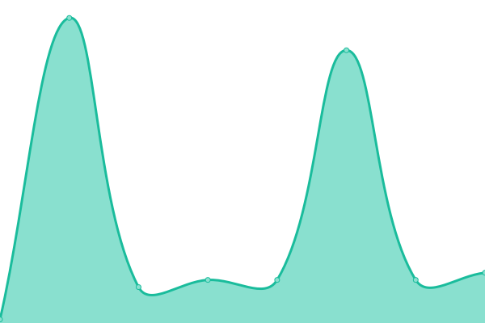

# [📈 Live Status](https://status.alchemyrpg.com): <!--live status--> **🟧 Partial outage**

This repository contains the open-source uptime monitor and status page for [Alchemy](https://alchemyrpg.com), powered by [Upptime](https://github.com/upptime/upptime).

With [Upptime](https://upptime.js.org), you can get your own unlimited and free uptime monitor and status page, powered entirely by a GitHub repository. We use [Issues](https://github.com/alchemyrpg/upptime/issues) as incident reports, [Actions](https://github.com/alchemyrpg/upptime/actions) as uptime monitors, and [Pages](https://status.alchemyrpg.com) for the status page.

<!--start: status pages-->
<!-- This summary is generated by Upptime (https://github.com/upptime/upptime) -->
<!-- Do not edit this manually, your changes will be overwritten -->
<!-- prettier-ignore -->
| URL | Status | History | Response Time | Uptime |
| --- | ------ | ------- | ------------- | ------ |
|  [App](https://app.alchemyrpg.com) | 🟩 Up | [app.yml](https://github.com/alchemyrpg/upptime/commits/HEAD/history/app.yml) | 

 232ms
     
 | 

<a href="https://status.alchemyrpg.com/history/app">100.00%</a>
    

|  API | 🟥 Down | [api.yml](https://github.com/alchemyrpg/upptime/commits/HEAD/history/api.yml) | 

 214ms
     
 | 

<a href="https://status.alchemyrpg.com/history/api">4.73%</a>
    

|  RTC API | 🟥 Down | [rtc-api.yml](https://github.com/alchemyrpg/upptime/commits/HEAD/history/rtc-api.yml) | 

 231ms
     
 | 

<a href="https://status.alchemyrpg.com/history/rtc-api">12.06%</a>
    

|  [Marketing Site](https://alchemyrpg.com) | 🟩 Up | [marketing-site.yml](https://github.com/alchemyrpg/upptime/commits/HEAD/history/marketing-site.yml) | 

 316ms
     
 | 

<a href="https://status.alchemyrpg.com/history/marketing-site">100.00%</a>
    

|  [Developer Documentation](https://alchemyrpg.github.io/slate) | 🟩 Up | [developer-documentation.yml](https://github.com/alchemyrpg/upptime/commits/HEAD/history/developer-documentation.yml) | 

 221ms
     
 | 

<a href="https://status.alchemyrpg.com/history/developer-documentation">100.00%</a>
    

<!--end: status pages-->

[**Visit our status website →**](https://status.alchemyrpg.com)

## 📄 License

- Powered by: [Upptime](https://github.com/upptime/upptime)
- Code: [MIT](./LICENSE) © [Alchemy](https://alchemyrpg.com)
- Data in the `./history` directory: [Open Database License](https://opendatacommons.org/licenses/odbl/1-0/)
